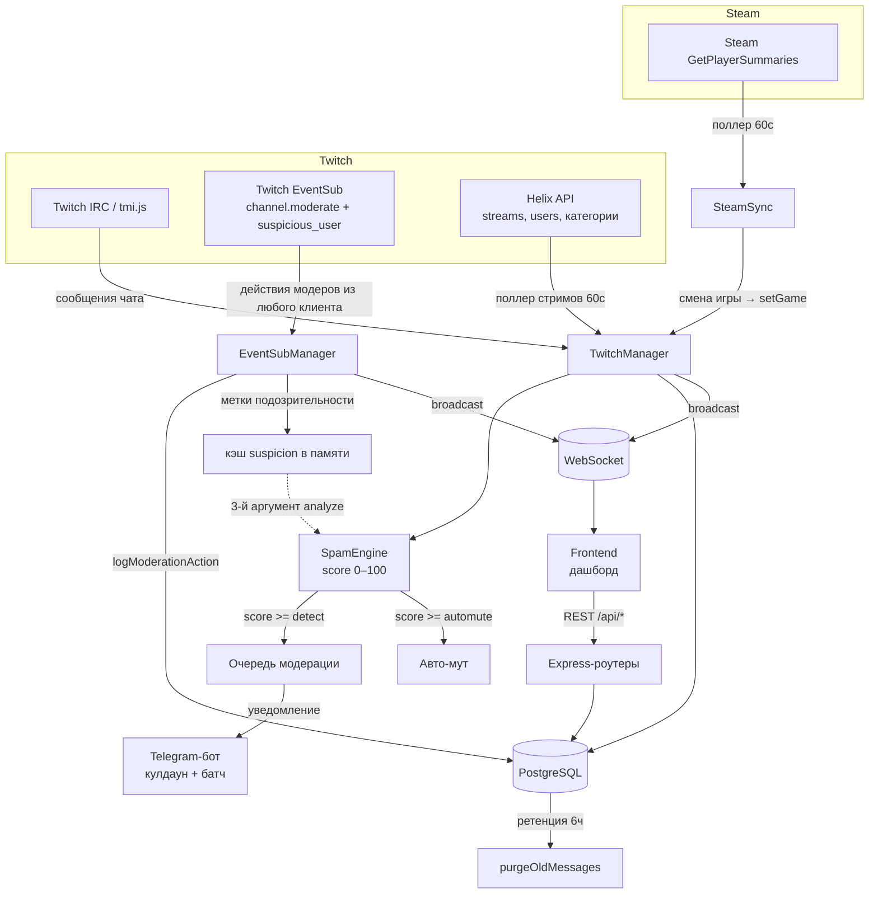

# Архитектура

Монорепо: `backend/` (Node + Express + TypeScript) и `frontend/` (React + Vite),
Postgres, всё в Docker Compose. Полная разбивка модулей — в
[`AGENTS.md` §3](../AGENTS.md).

```
frontend (React + Vite)   → :3000 (nginx в контейнере :80)
backend  (Node + Express) → :4000
database (PostgreSQL 15)  → :5432
```

## Поток данных



## Ключевые подсистемы

| Подсистема | Модуль | Назначение | Подробно |
|---|---|---|---|
| Приём чата | `twitch/TwitchManager` | IRC-коннект (глобальный бот + пер-юзер), обработка сообщений, `/timeout` `/ban`, `!g` | [§7](../AGENTS.md), [§13](../AGENTS.md) |
| Детект спама | `spam-engine/SpamEngine` | Чистая логика скоринга, без БД | [spam-detection.md](spam-detection.md), [§14](../AGENTS.md) |
| Действия из любого клиента | `twitch/EventSubManager` | `channel.moderate` v2 по WS — ловит баны/муты из Chatterino и панели Twitch | [§12](../AGENTS.md) |
| Сигнал подозрительности | `utils/suspicion` | Метки Twitch (обход бана и т.п.) как модификатор score | [§20](../AGENTS.md) |
| Токены | `twitch/twitchToken` | Рефреш user/broadcaster + app-токен, CAS-запись, single-flight | [§7–§9](../AGENTS.md) — **самое хрупкое** |
| Стримы | поллер в `TwitchManager` | Старт/энд сессий, пик зрителей, смены категории | [§21](../AGENTS.md) |
| Steam → категория | `steam/SteamSync` | Игра в Steam → категория на Twitch | [§22](../AGENTS.md) |
| Логирование модерации | `utils/modLog` | Единственная точка записи в `moderation_logs`, дедуп pile-on | [§18](../AGENTS.md) |
| Уведомления | `telegram/TelegramBot` | Пинги в Telegram с батчем и per-user кулдауном | [operations.md](operations.md#уведомления) |
| Метрики | `utils/metrics` | Prometheus на `GET /metrics` | [§17](../AGENTS.md) |
| Realtime | `websocket/wsHandler` | Broadcast всем клиентам дашборда | [api-reference.md](api-reference.md#websocket-события) |

## Инварианты, которые легко нарушить

Не трогай эти вещи, не прочитав соответствующий раздел:

- **Токены** — параллельные рефреши убивают грант (reuse-detection). See [§8](../AGENTS.md).
- **SpamEngine остаётся чистой логикой** — никакой БД/сети внутри. See [§14](../AGENTS.md), [§20](../AGENTS.md).
- **Запись модерации — только через `logModerationAction`**, никогда прямой INSERT. See [§18](../AGENTS.md).
- **Никаких `backdrop-filter`** во фронте (артефакт на Windows/Chrome). See [§10](../AGENTS.md).
- **Цвет серии графика привязан к сущности, а не к индексу массива.** See [§10](../AGENTS.md).
